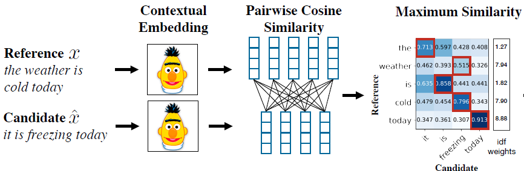

## Report
Disfluency Correction in Questions 

<strong>⚠️ In this part I will report some of the details of development.</strong>

## Table of Contents

- [Preliminary Research](#preliminary-research)
- [Sprint 1](#sprint-1)
    - [Thematically analyzed 100 records](#thematically-analyzed-100-records)
    - [Filled Missing Values](#filled-missing-values)
    - [Early Stopping](#early-stopping)
    - [Exploratory Data Analyses](#exploratory-data-analyses)
- [Sprint 2](#sprint-2)
     - [Semantic Similarity](#semantic-similarity)
- [Results Summary](#results-summary)
- [Future Works](#future-works)
- [References](#references)

## Preliminary Research

I began my research by studying the DISFL-QA dataset for understanding disfluencies in question answering [1], which inspired me to explore two primary approaches to address disfluency: classification and sequence-to-sequence (Seq2Seq) generation. For classification tasks, I leaned towards using BERT [8], as it has been widely adopted in text sequence labeling tasks. To further enhance BERT's capabilities, I considered incorporating Conditional Random Fields (CRFs) [10], which are known for their strength in structured prediction tasks. On the Seq2Seq front, I compared the T5 model [11] with BART [9]. I ultimately chose Seq2Seq task and utilized BART due to its superior performance in tasks like summarization, which aligns well with the needs of disfluency correction.

Additionally, I explored the possibility of enhancing these models with Reinforcement Learning from Human Feedback (RLHF), inspired by recent work on applying reinforcement learning to similar tasks [6, 7]. While RLHF seemed promising, after reviewing these studies, I concluded that the potential performance improvements might not justify the increased complexity in my agile development framework. Therefore, I decided to prioritize more straightforward and well-established techniques like BART for this phase of my research, while leaving RLHF as a potential area for future exploration.

As BLEU and GLEU scores are widely used for text generation evaluation, I began by assessing the corrected disfluencies using these two metrics [4, 5]. After analyzing the outputs and their corresponding BLEU and GLEU scores, I recognized the limitations of these syntax-based metrics and decided to incorporate a semantic similarity approach for evaluation. For semantic similarity, I considered two options: BERT-score [12] and BART-score [13]. BERT-score calculates text similarity by averaging word-level similarities, which I found insufficient for my needs. BART-score, while a more well-known approach, prompted further research to verify its state-of-the-art status. During this process, I found that Nomic AI [3] offers a more advanced method for calculating semantic similarity, which I adopted. Lastly, I computed confidence intervals for all the scores to ensure statistical robustness [14].

## Sprint 1

### Thematically analyzed 100 records
Please refer to the results folder for downloading the 100 records file with the least GLEU score. I thematically analyzed 100 records and here are the types:

1. Generated questions are better than the reference question: 3421, 460, 1689, 3608,
2. Missing value for the input ("disfluent": "#VALUE!”) in 13 cases like document 166
3. Need for a better metric that captures semantic similarity: 2287, 931, 795, 2264, 2301
4. Coreference disambiguating needed: 410, 3117, 2289, 940
5. Wrong generated dis-fluent question: 144, 117, 675

### Filled Missing Values

I used GPT4-o and prompt engineering to fill the missing values of train and development datasets. The prompt is as follows:

~~~
Task: Disfluency Generation in Questions

You are an intelligent AI assistant tasked with generating disfluent versions of fluent questions. A disfluent question contains errors, hesitations, or corrections that resemble natural speech patterns. There are three main types of disfluency to consider:
1. Repetition: A part of the question is repeated with a hesitation or error (e.g., “When is Eas ugh Easter this year?”).
2. Correction: A word or phrase is replaced after a momentary mistake (e.g., “When is Lent I meant Easter this year?”).
3. Restarts: The speaker begins the question with one phrase but then stops and starts over with the correct phrasing (e.g., “How much no wait when is Easter this year?”).

Components of a Disfluent Question:
* Reparandum: The part of the question that is intended to be replaced or ignored.
* Interregnum: Optional words or phrases that signal a correction or pause (e.g., "no wait", "I mean", "ugh”, “scratch that”, “ahm” or other correction words or signals).
* Repair: The corrected word or phrase that replaces the reparandum.

Example:
* Original Question: "When is Easter this year?"
* Disfluent Versions:
    * Repetition: "When is Eas ugh Easter this year?"
    * Correction: "When is Lent I meant Easter this year?"
    * Restarts: "How much no wait when is Easter this year?"

More example:
1. Original: "In what country is Normandy located?"
* Disfluent: "In what country is Norse found no wait Normandy not Norse?"
2. Original: "When were the Normans in Normandy?"
* Disfluent: "From which countries no tell me when were the Normans in Normandy?"
3. Original: "From which countries did the Norse originate?"
* Disfluent: "From which Norse leader I mean countries did the Norse originate?"
4. Original: "Who was the Norse leader?"
* Disfluent: "When I mean Who was the Norse leader?"
5. Original: "What century did the Normans first gain their separate identity?"
* Disfluent: "When no what century did the Normans first gain their separate identity?"

Your Task:
Using one of the three categories of disfluency (Repetition, Correction, or Restarts), be creative and generate a only one disfluent version of the following original question:
Original Question: [ENETER THE QUESTION HERE]
~~~

### Early Stopping

### Exploratory Data Analyses
 have conducted comprehensive Exploratory Data Analyses (EDA) to gain a deeper understanding of the dataset and uncover insights crucial for model optimization. Through this process, I was able to identify key characteristics of the data, which informed the selection of optimal hyperparameters such as the maximum input length, ultimately enhancing the model’s performance and efficiency.
 The following picture shows the token lenght distribution in the dataset base on which I set the value for "max_input_lenght" hyper parameter.
 

## Sprint 2

## Semantic Similarity

BERTScore calculates the semantic similarity word-by-word, which is too naive for our case.

As of now, NomicAI is the state-of-the-art. nomic-embed-text-v1 is 8192 context length text encoder that surpasses OpenAI text-embedding-ada-002 and text-embedding-3-small performance on short and long context tasks.

## References
  
[1] DISFL-QA: A Benchmark Dataset for Understanding Disfluencies in Question Answering

[2] My toturial: [https://youtu.be/wIkIxrsnUs8?si=3NtkXKgC87_Y7w2H&t=1515](https://youtu.be/wIkIxrsnUs8?si=3NtkXKgC87_Y7w2H&t=1515)

[3] Nomic AI: https://huggingface.co/nomic-ai/nomic-embed-text-v1 

[4] BLEU score formula: https://www.youtube.com/watch?v=DejHQYAGb7Q&t=646s 

[5] GLEU score: https://www.nltk.org/api/nltk.translate.gleu_score.html 

[6] Exploring the applicability of RL in this task: https://ar5iv.labs.arxiv.org/html/2305.14483

[7] Exploring the applicability of RL in this task: https://ar5iv.labs.arxiv.org/html/2310.08944

[8] BERT: Pre-training of Deep Bidirectional Transformers for Language Understanding

[9] BART: Denoising Sequence-to-Sequence Pre-training for Natural Language Generation, Translation, and Comprehension

[10] Conditional Random Fields: Probabilistic Models for Segmenting and Labeling Sequence Data

[11] T5: Exploring the Limits of Transfer Learning with a Unified Text-to-Text Transformer

[12] BERTScore: Evaluating Text Generation with BERT

[13] BARTScore: Evaluating Generated Text as Text Generation

[14] An Introduction to the Bootstrap

 
 
 

### Thank you for your interest in my AI development

 
 
 

